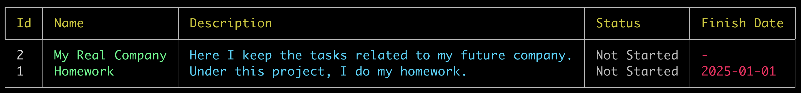

# cmdtaskmanager

`cmdtaskmanager` is a simple task manager. 


## Adding a project
On top of the hierarchy stands the project, where you can include tasks. 

**Note:** Tasks also might exist without a project, in case you want them to be for the general purpose.

To create a project, run the following command:
```bash
add-project 'Homework' -d 'Under this project, I do my homework.' -fd '2025-01-01'
```
`-d`, or `--description` - stands for the description  \
`-fd`, or `--finish-date` - stands for the finish date

Let's add one more:
```bash
add-project 'My Real Company' -d 'Here I keep the tasks related to my future company.'
```
This time we won't specify the finish date as there is no reason to do that in the current case.

Now we have projects, let's display them, with the following command:
```bash
display-project-list
```


In case you want to receive information only about some specific project run this command:

```bash
display-project 1
```
`1` is the project id, that might be found in the first column of the general project table.


To remove the project run:
```bash
remove-project 2
```

Let's update the project info:
```bash
update-project 2 -n 'My New Real Company' -d 'Here I keep the tasks related to my current company.'
```
**Note**: You need to pass only the properties which you want to update.

## Adding tasks
That is probably the most important part.

To create a task without a project just run the following command:
```bash
add-task 'Go to the store'
```
To create a task under the project:
```bash
add-task 'Clean up the room' -pi 1 -d 'No rush with this'
```
Now we have tasks, let's display them:
```bash
display-task-list
```


In case you want to display some specific task, run the following command:
```bash
display-task 2
```
`2` is the task id, that might be found in the first column of the general task table.


## Changing statuses

#### To display system available statuses:
```bash
display-status-list
```


#### To change the project status:
```bash
update-project 1 -si 2
```
`1` is the project id \
`2` is the status id

It's possible to update the project using the status name:
```bash
update-project 1 -sn 'In Progress'
```


Now we can see the status was changed.

#### To change the task status
It's possible to change task status in a similar manner as was changed status for the project.
```bash
update-task 1 -si 2
```
This command will update the task status to 'In Progress'.

But a more appropriate way of changing the task status is to use the changing status-specific commands.

Here is the task status changing commands:

Set task status to 'Not Started':
```bash
reset-task 1
```

Set task status to 'In Progress':
```bash
start-task 1
```

Set task status to 'Completed':
```bash
complete-task 1
```

Set task status to 'Postponed':
```bash
postpone-task 1
```

Set task status to 'Removed':
```bash
remove-task 1
```

## Adding comments
It's possible to add a comment to task:
```bash
add-comment 1 "It's better not to postpone this."
add-comment 1 "At least, I think so."
```
`1` is a task id

We can display comments in the table:
```bash
display-comment-list 1
```
`1` is a task id


or we can display task details and see comments there:


